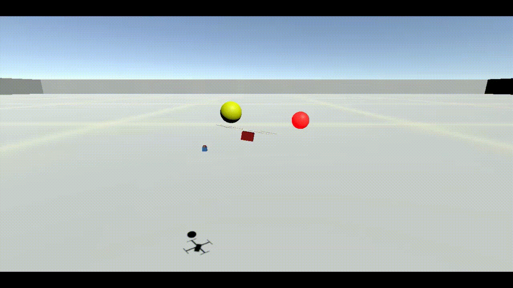

# Getting Started on the Air Force Arcade

__Instructions for getting AFA running locally.__

These instructions assume you have either [Anaconda](https://www.anaconda.com/products/individual) or [Miniconda](https://docs.conda.io/en/latest/miniconda.html) installed.

1. Download the AerialRefueling environment
  - Use this [Link](https://drive.google.com/file/d/1fVh5m3gEXIQyZq_igtIQyNs-zD0TnBmc/view?usp=sharing) to download the zip file
  - Extract the environment and place in the `baselines\airforce-arcade\builds` directory
  - If on MacOS, right click + open the `.app` file to accept the security warning
  - If on Linux, `chmod +x [path\to\AerialRefueling]\AerialRefueling.x86_64`

2. Create your environment. You can either build from the provided conda environment file or manually.
  - If using the provided `environment.yml` file:
    - `conda env create -f environment.yml`
  - If creating your environment manually:
    - `conda create --name iap_afa pip python=3.8.5`
    - `conda activate iap_afa`
    - `pip install torch`
    - `pip install tensorflow`
    - `pip install opencv-python`
    - `pip install gym`
    - `conda install -c conda-forge notebook`
    - `conda install matplotlib`
    - `pip install 'ray[rllib]'`

3. Install the Air Force Arcade package
    - Move to the `baselines/airforce-arcade` folder in your directory
    - `pip install -e .`

4. Create an IPython kernel to use with your notebook
  - `python -m ipykernel install --user --name iap_afa --display-name "iap_afa"`
  - This step ensures you can use your conda environment as your kernel in Jupyter

5. Play around in the provided notebook with some starter code
  - In your terminal, return to the main repo directory
  - In your terminal, launch jupyter: `jupyter notebook`
  - Navigate to `examples\Getting_Started.ipynb`

Once you feel comfortable using the environment, you can begin using the advanced starter code with RLlib in the `baselines` folder.
RLlib will provide faster training on more advanced algorithms, which is especially helpful on Supercloud.
